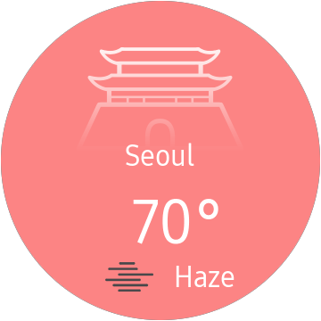
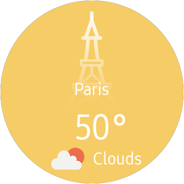
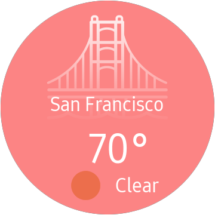

# Pretty Weather
------
This project is forked from [jamesmontemagno/app-pretty-weather](https://github.com/jamesmontemagno/app-pretty-weather), and customized to fit on Widget application for SmartWatch.

A very pretty weather application built with Xamarin.

  
  

## Built with
* [Xamarin.Forms](http://xamarin.com/forms)

## Misc

Lisences under MIT

Space Needle icon by [Blair Adams via The Noun Project](https://thenounproject.com/search/?q=space%20needle&i=915578)

Design by [Guzman Barquin via Uplabs](https://www.uplabs.com/posts/weather-app-f41080cc-063a-499b-ad9c-18936575a5ac)
